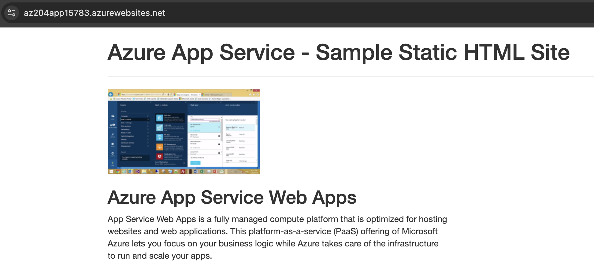

# Exercise: Create a static HTML web app by using Azure Cloud Shell

```bash
mkdir htmlapp
cd htmlapp
git clone https://github.com/Azure-Samples/html-docs-hello-world.git
resourceGroup=$(az group list --query "[].{id:name}" -o tsv)
appName=az204app$RANDOM
echo $resourceGroup
echo $appName
cd html-docs-hello-world
az webapp up -g $resourceGroup -n $appName --html
```

```json
{
  "URL": "http://az204app15783.azurewebsites.net",
  "appserviceplan": "maheswarim.work_asp_0282",
  "location": "canadacentral",
  "name": "az204app15783",
  "os": "Windows",
  "resourcegroup": "learn-d286af8e-3701-45f1-9e57-1bbe71146437",
  "runtime_version": "-",
  "runtime_version_detected": "-",
  "sku": "FREE",
  "src_path": "//home//maheswarim_work//htmlapp//html-docs-hello-world"
}
```

